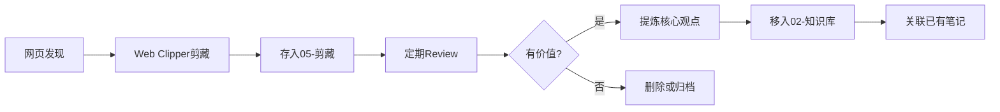

# 05-剪藏

> 网页剪藏收集箱 —— 临时存放，定期处理

---

## 📋 使用流程



---

## 🗂️ 文件命名规范

```
YYYY-MM-DD-文章标题.md
```

示例：
- `2026-03-31-Claude-Code源码泄露分析.md`
- `2026-03-30-岩土工程新规范解读.md`

---

## 📝 模板说明

- **[[_模板]]** — 标准剪藏模板（配合 Web Clipper 使用）
- **[[00-系统/templates/reading-clip\|reading-clip]]** — 剪藏后提炼模板（移入知识库前使用）
- 包含：元数据、原文、核心要点、想法、关联、行动清单

---

## 📊 待处理剪藏

```dataviewjs
dv.table(
  ["标题", "日期", "来源", "状态"],
  dv.pages('"05-剪藏"')
    .where(p => p.status == "未处理" || !p.status)
    .sort(p => p.date, 'desc')
    .map(p => [
      p.file.link,
      p.date ? p.date.substring(0, 10) : "-",
      p.source ? p.source.replace(/^https?:\/\//, '').split('/')[0] : "-",
      p.status || "未处理"
    ])
)
```

---

## ✅ 处理清单

- [ ] 定期 review（建议每周一次）
- [ ] 提炼核心观点
- [ ] 分类移入知识库
- [ ] 删除无价值内容

---

⬅️ [[HOME\|返回首页]] · [[02-知识库\|知识库]] · [[00-系统/使用指南\|使用指南]] ➡️
